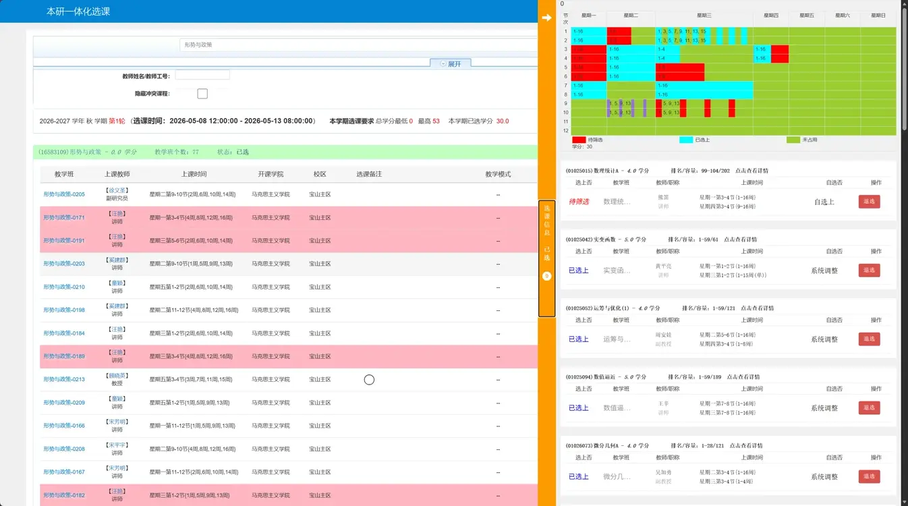

# 鼠鼠选课plus

上海大学选课系统（教务系统）增强油猴脚本，适用于 jwxt.shu.edu.cn 和 byxk.shu.edu.cn。

**理论上此脚本适用于任何使用了正方教务的系统，但是需要进行微调。**

## 功能

1. **跳过通知页**：自动跳过选课页面开头的30秒通知页，直接进入选课。
2. **课表可视化重绘**：将课程列表中的数据重新绘制为彩色课表，不同颜色区分已选上（浅蓝）、待筛选（红色）、未占用（黄绿色），并显示总学分。
3. **排名/容量显示**：在每个已选/待选课程标题后显示排名区间和课程容量，点击可查看详情。
4. **教师/工号搜索**：在搜索区域新增教师姓名/工号输入框，可过滤包含指定教师的课程。
5. **冲突课程检测与隐藏**：勾选"隐藏冲突课程"后可自动隐藏与当前课表冲突的课程；未勾选时冲突课程背景标为粉色。
6. **鼠标悬停预览冲突**：将鼠标移到搜索结果中的课程上，右侧课表会临时渲染该课程的占用情况，方便浏览冲突。
7. **课程评分集成（选课小本本）**：从 course-rate.icu 拉取课程评分数据，在课表课程旁显示评分 emoji 图标，点击可弹出评分详情页。

## 安装方式

1. 在浏览器中安装 **Tampermonkey**（油猴）扩展。
   - Chrome / Edge：[Tampermonkey](https://www.tampermonkey.net/)
   - Firefox：[Tampermonkey](https://addons.mozilla.org/zh-CN/firefox/addon/tampermonkey/)
  其他类似扩展皆可（作者本人使用的是`脚本猫`）
2. 打开 Tampermonkey 控制面板，点击"添加新脚本"。
3. 将 `鼠鼠选课plus.js` 的完整内容复制粘贴到编辑器中。
4. 保存脚本（Ctrl+S），确保脚本已启用。
5. 刷新选课页面即可生效。

## 注意事项

- 有时候因为脚本加载失败导致无法跳过通知，此时直接刷新界面即可。
- 冲突检测需要先打开一次右侧课表栏以缓存课表数据，否则会弹出提示"课表未缓存，无法显示冲突信息！"。
- 课程评分功能依赖外部站点 `course-rate.icu`，网络不畅时评分 emoji 可能无法加载（不影响其他功能）。

### 使用建议
- 使用冲突隐藏/预览功能前，务必先点击课表标签页加载课表数据。
- 教师筛选和冲突过滤仅在搜索结果中生效，不会影响已选课程列表。
